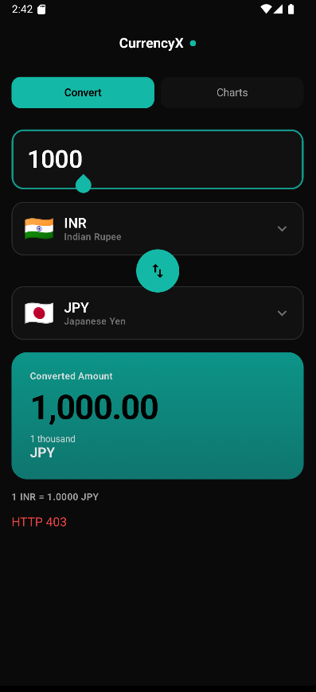
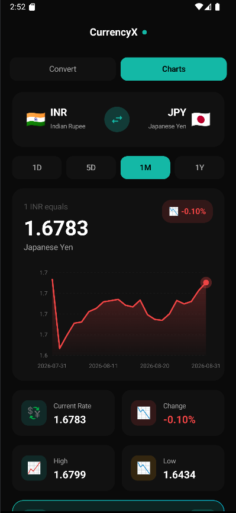

# CurrencyX

CurrencyX is a polished Android currency converter with real-time rates, cached offline data, and trend charts. It is built with Jetpack Compose, Material 3, Navigation 3, Hilt, Room, Retrofit, OkHttp, Kotlin Serialization, Coroutines, and Vico charts.

<p>
  
</p>

## Features

- Real-time exchange rates for 150+ currencies (Exchangerate-API)
- Offline support with cached rates
- Favorite currency pairs
- Material 3 dark theme (emerald)
- Clean architecture: MVVM, domain/data layers, Hilt, Room, Retrofit

## Preview

<p>
  
  
</p>

## Tech Stack

- **Architecture**: MVVM, Clean Architecture
- **Build**: Android Gradle Plugin 8.9.2, Gradle 8.13, Kotlin 2.0.21
- **UI**: Jetpack Compose, Compose BOM 2024.09.00, Material 3, Material Icons Extended
- **Navigation**: AndroidX Navigation 3 runtime/UI 1.1.7
- **DI**: Hilt/Dagger 2.57.1, AndroidX Hilt Lifecycle ViewModel Compose 1.3.0
- **Lifecycle**: Lifecycle Runtime KTX/Compose 2.10.0, Lifecycle ViewModel Compose 2.7.0, StateFlow
- **Networking**: Retrofit 2.9.0, OkHttp 4.12.0, OkHttp Logging Interceptor 4.12.0
- **Serialization**: Kotlinx Serialization JSON 1.6.2, Retrofit Kotlin Serialization Converter 1.0.0
- **Local storage**: Room Runtime/KTX/Compiler 2.8.3
- **Async**: Kotlin Coroutines Android 1.7.3
- **Charts**: Vico Compose, Compose Material 3, and Core 1.13.1
- **Testing**: JUnit 4.13.2, AndroidX JUnit 1.3.0, Espresso Core 3.7.0, Compose UI Test

## Requirements

- Android Studio with Android Gradle Plugin 8.9.2 support
- Android SDK 36
- Exchangerate-API key stored locally in `local.properties`

## Setup

1. Clone the repository.
2. Get a free API key from [exchangerate-api.com](https://www.exchangerate-api.com/).
3. Create or edit `local.properties` in the project root and add:
   ```properties
   API_KEY=your_api_key_here
   ```
4. Build and run:
   ```bash
   ./gradlew assembleDebug
   ```

## Project structure

```
app/src/main/java/com/shrey/currencyx/
├── data/       # API, Room, repository impl, mappers
├── di/         # Hilt modules
├── domain/     # Models, repository interface, use cases
├── ui/         # Screens, ViewModels, components, theme
└── util/       # Resource, extensions, logging
```

## Logging and comments

- **Logs**: Use `LogUtil.e()` only for errors and cache fallback (tag: `CurrencyX`). No debug/verbose in production.
- **KDoc**: Only on public API (repository interface, use cases, reusable composables). One line where enough.
- **Comments**: Only for non-obvious logic (e.g. cache fallback on network error).

## License

MIT
